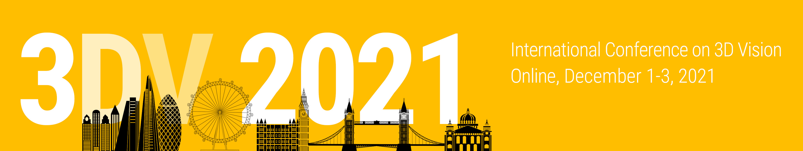

MV-NRSfM: High Fidelity 3D Reconstructions with Limited Physical Views (3DV 2021)
============




### [Paper](https://arxiv.org/abs/2110.11599) | [Project page](https://mv-nrsfm.github.io) | [Pretrained models](https://doi.org/10.5281/zenodo.7054596) | [Featured Post](https://www.adelaide.edu.au/aiml/news/list/2022/08/01/new-ai-tech-to-bring-human-like-understanding-of-our-3d-world)


## TL;DR Summary

Enforcing <b>Neural "shape" Priors</b> and <b>multi-view equivariance</b> within modern deep 2D-3D lifting enables generation of high-fidelity 3D reconstructions using just <b>2-3 uncalibrated cameras</b>, compared to <b>>100 calibrated cameras</b>.

## Overview 

<p align="center">
  
</p>

&nbsp;

## Requirements

- Tested in ``Pytorch 1.11``, with ``CUDA 11.3``

&nbsp;

## Setup

1. Create a conda environment and activate it.
    ```
    conda env create -f environment.yml
    conda activate mvnrsfm
    pip install opencv-python
    ```
2. Please do a clean install of the submodule [`robust_loss_pytorch`](https://github.com/jonbarron/robust_loss_pytorch):
    ```
    pip install git+https://github.com/jonbarron/robust_loss_pytorch
    ```
3. Please do a clean install of the submodule [`torch_batch_svd`](https://github.com/KinglittleQ/torch-batch-svd): (if using GPU)
    ```
    cd modules/helpers/torch-batch-svd
    export CUDA_HOME=/your/cuda/home/directory/    
    python setup.py install
    ```

## Pre-trained models

Fetch the pre-trained mv-nrsfm models from Zenodo using:

    ``` 
    zenodo_get 10.5281/zenodo.7346689
    unzip models.zip
    rm -rf models.zip && rm -rf md5sums.txt
    ```


## Demo
We have provided the pretrained models for [Human36M](http://vision.imar.ro/human3.6m/description.php) (Subject #1, Directions 1 Sequence), [Cheetah dataset](https://github.com/African-Robotics-Unit/AcinoSet), and [Monkey dataset](https://github.com/OpenMonkeyStudio/OMS_Data) along with the annotation data in the `data` directory.

Please run `demo.ipynb` to play around the validation part of Neural Shape Prior based MV-NRSfM. You can either use pretrained models and data given in this repository or plug your own trained models in this demo script. You can visualize the 3D structure as well as 2D predictions (w/ and w/o overlaying on original RGB image). The reconstructed 3D could be visualized via plotly:

<p align="center">
  
</p>


## Run unit tests

    ./scripts/unit_tests.sh


## Training (Generate 3D labels from MV-NRSfM)

    ./scripts/train_mvnrsfm.sh


